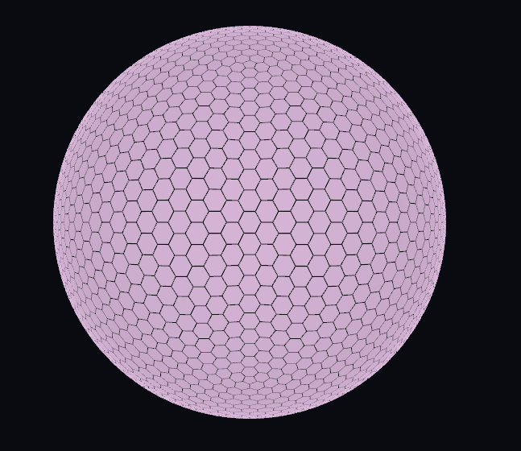
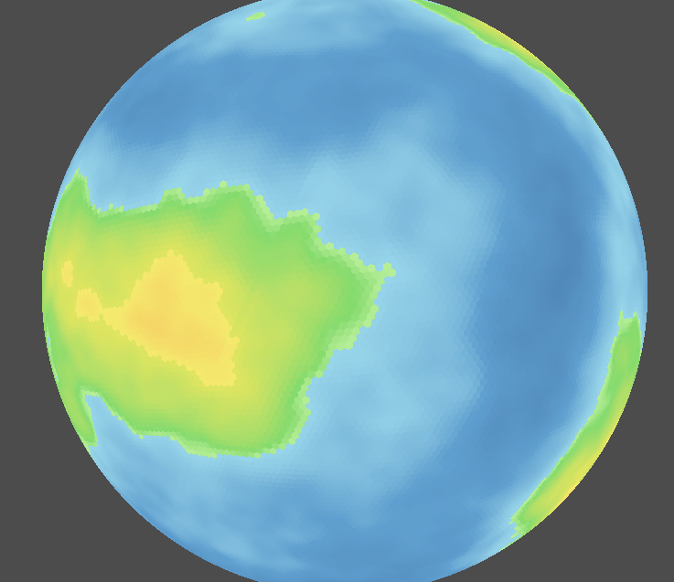

# Hexasphere Generator for Godot 4

A procedural hexagonal sphere generator for Godot 4. Generates a spherical grid of hexagons with exactly 12 pentagons (fullerene topology).

The math core is written in **C++ (GDExtension)** for maximum performance, with a thin C# wrapper for seamless integration.

Inspired by [Em3rgencyLT's Unity Hexasphere](https://github.com/Em3rgencyLT/Hexasphere).





## Installation

1. Copy `addons/hexasphere_generator/` into your project's `addons/` folder.
2. Enable the plugin in **Project → Project Settings → Plugins**.
3. Pre-built `hexasphere.dll` for **Windows** is included in `addons/hexasphere_generator/bin/`.

### Linux

Pre-built `.so` for Linux is available as a [GitHub Actions artifact](https://github.com/fwdssh/hexasphere/actions).
Download the latest build and place `hexasphere.so` into `addons/hexasphere_generator/bin/`.

Alternatively, [build from source](#building-the-native-library).

## Quick Start

### Via the Editor (Plugin)

1. Enable the plugin in **Project → Project Settings → Plugins**.
2. Click **Add Node (Ctrl+A)** and search for `Hexasphere`.
3. Select the node, tweak parameters in the Inspector, and run.

### Via the Scene

1. Instance `hexasphere.tscn` (or `addons/hexasphere_generator/example.tscn`) into your scene.
2. Select the `Hexasphere` node and tweak parameters in the Inspector.
3. Run — the sphere generates on a background thread.

### Via Script

The main node script lives at `addons/hexasphere_generator/scripts/hexasphere_node/HexasphereNode.cs`.
Use `SetCellColor(index, color)` to modify any tile after generation:

```csharp
using Godot;

public partial class MyController : Node
{
    public override void _Ready()
    {
        var planet = GetNode<HexasphereNode>("Hexasphere");
    }

    public override void _Process(double delta)
    {
        // Wait for planet to finish generating
        if (planet.IsReady)
        {
            // Color first tile red
            planet.SetCellColor(0, Colors.Red);

            // Get current color
            Color c = planet.GetCellColor(0);
        }
    }
}
```

### Low-Level API (NativeHexasphere)

```csharp
using Godot;

public partial class MyPlanet : Node3D
{
    public override void _Ready()
    {
        var hex = new NativeHexasphere();
        hex.Generate(10f, 20, 1f);

        var result = hex.BuildMesh();
        var mesh = (ArrayMesh)result["mesh"];

        var mi = new MeshInstance3D();
        mi.Mesh = mesh;
        AddChild(mi);
    }
}
```

## Folder Structure

```
addons/hexasphere_generator/
├── bin/                              # GDExtension binaries
│   ├── hexasphere.dll                # Windows binary
│   ├── hexasphere.so                 # Linux binary (build via CI)
│   └── hexasphere.gdextension        # Entry config
├── scripts/
│   ├── hexasphere_node/              # Main plugin scripts
│   │   ├── HexasphereNode.cs         # Main node (Ctrl+A → Hexasphere)
│   │   ├── HexasphereVisualController.cs
│   │   ├── NativeHexasphere.cs       # C# wrapper for C++ GDExtension
│   │   ├── HexCellData.cs            # Per-cell data (color, etc.)
│   │   ├── PlanetBorderRenderer.cs
│   │   └── shaders/
│   │       ├── hexasphere_colors.gdshader
│   │       └── hexasphere_borders.gdshader
│   ├── example/                      # Demo scene
│   │   ├── HexasphereExample.cs
│   │   ├── Camera3d.cs
│   │   └── BenchmarkRunner.cs
│   └── hexasphere_math/              # C# old math reference (not used)
├── icon.svg
├── plugin.cfg
├── plugin.gd
└── example.tscn
```

## Parameters

| Parameter | Type | Default | Description |
|---|---|---|---|
| `PlanetRadius` | float | 20 | Sphere radius |
| `SubDivision` | int | 20 | Grid density (tile count ∝ divisions²) |
| `HexSize` | float (0–1) | 1.0 | 1.0 = gapless, lower = gaps between tiles |
| `IsBordering` | bool | true | Show tile borders |
| `BorderColor` | Color | White | Border line color |

## Architecture

```
┌──────────────────────────────────────────────┐
│  C++ (native/src/)                           │
│  Point → Face → Tile → Hexasphere           │
│         ↕                                    │
│  NativeHexasphere (RefCounted bridge)        │
│  - generate()                                │
│  - build_mesh()    → ArrayMesh               │
│  - get_border_data() → Dictionary            │
│  - get_build_data()  → Dictionary            │
└──────────────┬───────────────────────────────┘
               │ GDExtension
┌──────────────▼───────────────────────────────┐
│  C# (addons/hexasphere_node/)                 │
│  NativeHexasphere.cs        — thin wrapper   │
│  HexasphereNode.cs          — main node      │
│  HexasphereVisualController — visuals        │
│  PlanetBorderRenderer       — border lines    │
└──────────────────────────────────────────────┘
```

- **C++ layer** — pure math: icosahedron subdivision, tile boundary computation, mesh array generation. No Godot dependencies in the core classes.
- **NativeHexasphere** — a `RefCounted` registered with GDExtension. Exposes `generate()`, `build_mesh()`, `get_border_data()`, etc.
- **C# layer** — orchestration, Godot node management, shader material setup, border rendering.

`build_mesh()` builds the `ArrayMesh` entirely in C++ using direct vertex/normal/UV2 arrays + `add_surface_from_arrays()`, bypassing `SurfaceTool` entirely.

## Building the Native Library

### From Source

```bash
cd native
scons target=template_debug
```

The binary is output to `addons/hexasphere_generator/bin/`.

| Platform | `platform=` |
|---|---|
| Windows | (default) |
| Linux | `platform=linux` |
| macOS | `platform=macos` |

Requires a working C++17 compiler, Python 3, and SCons.

### Via GitHub Actions

Push to `main` — the [build workflow](.github/workflows/build.yml) automatically compiles `hexasphere.so` for Linux.
Download the artifact from the Actions page and extract into `addons/hexasphere_generator/bin/`.

## Benchmark

| SubDivision | Tiles | C++ Gen | C# Gen | C++ Mesh | C# Mesh | C++ All | C# All |
|-----|------:|--------:|-------:|---------:|--------:|--------:|-------:|
|   5 |   252 |   0,6ms |  2,1ms |    0,4ms |   0,7ms |   1,1ms |  2,8ms |  
|  10 |  1002 |   2,3ms |  7,5ms |    1,0ms |   3,0ms |   3,3ms | 10,5ms |  
|  20 |  4002 |   8,8ms | 36,5ms |    4,3ms |  17,4ms |  13,1ms | 53,9ms |  
|  30 |  9002 |  18,7ms | 66,5ms |   10,3ms |  46,1ms |  28,9ms |112,6ms | 
|  50 | 25002 |  55,4ms |187,1ms |   31,5ms | 122,6ms |  86,9ms |309,7ms | 
|  75 | 56252 | 128,0ms |447,4ms |   72,8ms | 255,4ms | 200,8ms |702,7ms |  
| 100 |100002 | 253,0ms |760,7ms |  127,0ms | 490,1ms | 380,1ms |1250,7ms|  


