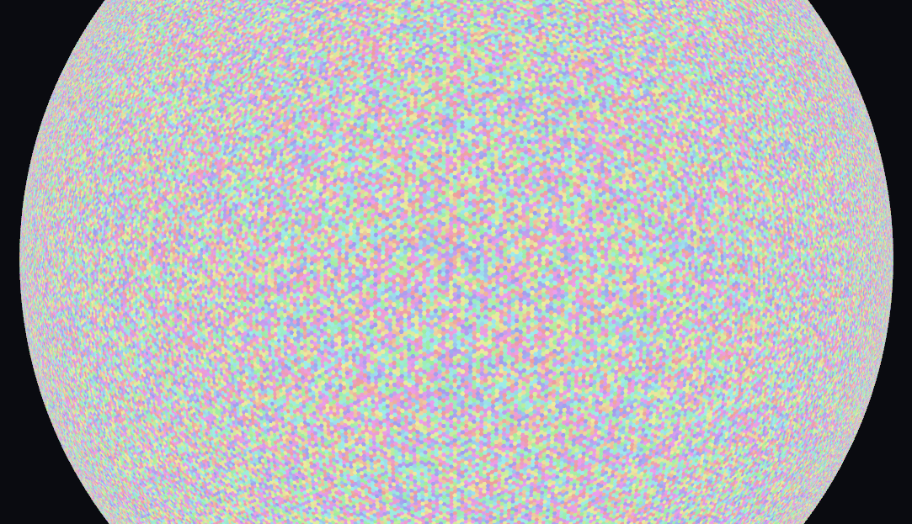

# Hexasphere Generator for Godot 4

A procedural hexagonal sphere generator for Godot 4. Generates a spherical grid of **hexagons with exactly 12 pentagons**.

The math core is written in **C++ (GDExtension)** for maximum performance, with a thin C# wrapper for seamless integration.

Inspired by [Em3rgencyLT's Unity Hexasphere](https://github.com/Em3rgencyLT/Hexasphere).




## Features

- **Hexagonal sphere** — procedural generation with configurable subdivision
- **Fullerene topology** — exactly 12 pentagons, rest are hexagons
- **High performance** — C++ GDExtension core with pure C# fallback 
- **Hexasphere Node** — `HexasphereNode` available in **Add Node**
- **Per-tile coloring** — custom colors via shader + `ImageTexture` (no per-tile materials)
- **Click & hover** — `TileClicked` / `TileHovered` signals with raycast hit detection
- **Custom tile data** — implement `ICellData` for biomes, heights, colors per tile
- **Cross-platform** — Windows (pre-built), Linux & macOS [(build from source)](#building-the-native-library)

## Installation

1. Copy `addons/hexasphere_generator/` into your project's `addons/` folder.
2. Enable the plugin in **Project → Project Settings → Plugins**.
3. Pre-built `hexasphere.dll` for **Windows** is included in `addons/hexasphere_generator/bin/`.


## Quick Start

### Via the Editor

1. Enable the plugin in **Project → Project Settings → Plugins**.
2. Click **Add Node (Ctrl+A)** and search for `Hexasphere`.
3. Select the node, tweak parameters (`PlanetRadius`, `SubDivision`, `HexSize`) in the Inspector, and run.

### Via Script — HexasphereNode

Inherit `HexasphereNode`, override virtual methods, subscribe to signals:

```csharp
public partial class MyPlanet : HexasphereNode
{
    public override void _Ready()
    {
        base._Ready();
        TileClicked += (idx, pos) => GD.Print($"Clicked tile {idx}");
    }

    protected override ICellData[] CreateCellData(int count)
    {
        var data = new MyTileData[count];
        for (int i = 0; i < count; i++)
            data[i] = new MyTileData { Biome = GD.Randi() % 3 };
        return data;
    }
}
```

### Via Script — NativeHexasphere

Only generation and mesh, no editor node:

```csharp
public partial class MyPlanet : Node3D
{
    public override void _Ready()
    {
        var hex = new NativeHexasphere();
        hex.Generate(10f, 20, 1f);

        var result = hex.BuildMesh();
        var mesh = (ArrayMesh)result["mesh"];

        var mi = new MeshInstance3D();
        mi.Mesh = mesh;
        AddChild(mi);
    }
}
```

## Signals

`HexasphereNode` emits the following signals for mouse interaction:

| Signal | Arguments | Description |
|---|---|---|
| `TileClicked` | `(int tileIndex, Vector3 worldPosition)` | A tile was clicked |
| `TileHovered` | `(int tileIndex)` | Mouse hovers over a tile |
| `TileDeselected` | — | Selection was cleared (clicked empty space) |

`HexasphereVisualController` emits:

| Signal | Arguments | Description |
|---|---|---|
| `ShaderReady` | — | The internal shader is initialized and ready for rendering |

```csharp
public partial class MyPlanet : HexasphereNode
{
    public override void _Ready()
    {
        base._Ready();
        TileClicked += OnTileClicked;
        TileHovered += OnTileHovered;
    }

    private void OnTileClicked(int index, Vector3 position)
    {
        GD.Print($"Clicked tile {index} at {position}");
    }

    private void OnTileHovered(int index)
    {
        GD.Print($"Hovering over tile {index}");
    }
}
```

## Custom Cell Data

Implement `ICellData` for custom per-tile data and override `GetColor` in a custom visual controller:

```csharp
using Godot;

public class MyTileData : ICellData
{
    public Color color;
    public float Height;
    public int Biome;
}

public partial class MyVisual : HexasphereVisualController
{
    public override Color GetColor(ICellData cellData)
    {
        if (cellData is MyTileData tile)
            return tile.Height > 0.5f ? Colors.Green : Colors.Brown;
        return base.GetColor(cellData);
    }
}
```

To provide custom data, override `CreateCellData` in a subclass of `HexasphereNode`:

```csharp
using Godot;

public partial class MyPlanet : HexasphereNode
{
    protected override ICellData[] CreateCellData(int count)
    {
        var data = new MyTileData[count];
        for (int i = 0; i < count; i++)
            data[i] = new MyTileData { color = Colors.Gray, Height = 1f };
        return data;
    }
}
```
### Overridable Methods

Key virtual methods in `HexasphereNode`:

| Method | Purpose |
|---|---|
| `CreateCellData(int count)` | Create array of `ICellData[]` with custom per-tile data |
| `OnShaderReady()` | Called when the visual shader is initialized |
| `FinalizePlanet()` | Called after planet generation completes |
| `FindTileIndexByDirection(Vector3 direction)` | Custom hit-test: returns tile index by ray direction |
| `BuildSpatialIndex(NativeHexasphere hex)` | Build custom spatial index for tile lookup |

Key virtual methods in `HexasphereVisualController`:

| Method | Purpose |
|---|---|
| `GetColor(ICellData cellData)` | Return a color for a given tile (see example above) |
| `SetRoughness(float value)` | Set material roughness |
| `Draw(ICellData[] cellDatas, ...)` | Full redraw of all tiles |
| `InitShaderMaterial()` | Initialize the shader material |
| `DisposeHexasphere()` | Clean up resources |

## Architecture

```
┌──────────────────────────────────────────────┐
│  C++ (native/src/)                           │
│  Point → Face → Tile → Hexasphere            │
│         ↕                                    │
│  NativeHexasphere (RefCounted bridge)        │
│  - generate()                                │
│  - build_mesh()    → ArrayMesh               │
│  - get_border_data() → Dictionary            │
│  - get_build_data()  → Dictionary            │
└──────────────┬───────────────────────────────┘
               │ GDExtension
┌──────────────▼───────────────────────────────┐
│  C# (addons/hexasphere_node/)                │
│  NativeHexasphere.cs        — thin wrapper   │
│  HexasphereNode.cs          — main node      │
│  HexasphereVisualController — visual node    │
│  PlanetBorderRenderer       — border lines   │
└──────────────────────────────────────────────┘
```

- **C++ layer** — pure math: icosahedron subdivision, tile boundary computation, mesh array generation. No Godot dependencies in the core classes.
- **NativeHexasphere** — a `RefCounted` registered with GDExtension. Exposes `generate()`, `build_mesh()`, `get_border_data()`, etc.
- **C# layer** — orchestration, Godot node management, shader material setup, border rendering.

## Building the Native Library

### From Source

```bash
cd native
scons target=template_debug
```

The binary is output to `addons/hexasphere_generator/bin/`.

| Platform | `platform=` |
|---|---|
| Windows | (default) |
| Linux | `platform=linux` |
| macOS | `platform=macos` |

Requires a working C++17 compiler, Python 3, and SCons.

## Benchmark
| Div | Tiles | C++ Gen | C# Gen | C++ Mesh | C# Mesh | C++ All | C# All |
|-----|------:|--------:|-------:|---------:|--------:|--------:|-------:|
|   5 |   252 |   0,6ms |  2,1ms |    0,4ms |   0,7ms |   1,1ms |  2,8ms |
|  10 |  1002 |   2,3ms |  7,5ms |    1,0ms |   3,0ms |   3,3ms | 10,5ms |
|  20 |  4002 |   8,8ms | 36,5ms |    4,3ms |  17,4ms |  13,1ms | 53,9ms |
|  30 |  9002 |  18,7ms | 66,5ms |   10,3ms |  46,1ms |  28,9ms |112,6ms |
|  50 | 25002 |  55,4ms |187,1ms |   31,5ms | 122,6ms |  86,9ms |309,7ms |
|  75 | 56252 | 128,0ms |447,4ms |   72,8ms | 255,4ms | 200,8ms |702,7ms |
| 100 |100002 | 253,0ms |760,7ms |  127,0ms | 490,1ms | 380,1ms |1250,7ms|


