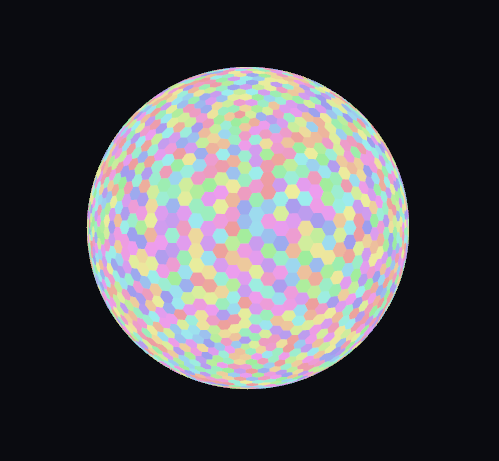
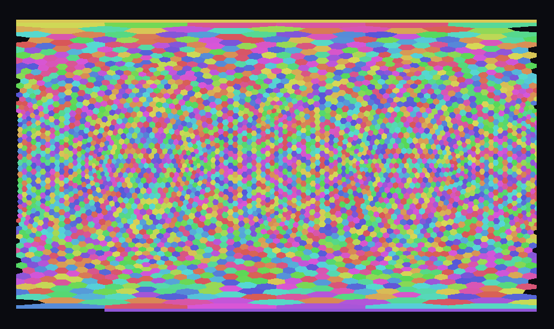

# Hexasphere Generator for Godot 4

A procedural hexagonal sphere generator for Godot 4. Generates a spherical grid of **hexagons with exactly 12 pentagons**.

The math core is written in **C++ (GDExtension)** for maximum performance, with a C# wrapper for seamless integration.




## Features

- **Hexagonal sphere** — procedural generation with configurable subdivision
- **Fullerene topology** — exactly 12 pentagons, rest are hexagons
- **High performance** — C++ GDExtension core with C# wrapper
- **Hexasphere Node** — `HexasphereNode` available in **Add Node**
- **Per-tile coloring** — custom colors via shader + `ImageTexture` (no per-tile materials)
- **Click & hover** — `TileClicked` / `TileHovered` signals with raycast hit detection
- **Custom tile data** — implement `ICellData` for biomes, heights, colors per tile
- **UV projection** — 2D map view with pan/zoom and tile selection
- **Cross-platform** — Windows (pre-built binary included), Linux and macOS can be built from source

## Installation

1. Copy `addons/hexasphere_generator/` into your project's `addons/` folder.
2. Enable the plugin in **Project → Project Settings → Plugins**.
3. Pre-built `hexasphere.dll` for **Windows** is included in `addons/hexasphere_generator/bin/`. For Linux and macOS, build from source (see [Building the Native Library](#building-the-native-library)).

## Quick Start

### Via the Editor

1. Enable the plugin in **Project → Project Settings → Plugins**.
2. Click **Add Node (Ctrl+A)** and search for `Hexasphere`.
3. Select the node, tweak parameters (`PlanetRadius`, `SubDivision`, `HexSize`) in the Inspector, and run.


### Via Script — GDScript

Use `HexasphereNode` from GDScript by adding it as a child node and connecting to signals:

```gdscript
extends Node3D

@onready var sphere: Node3D = $MyHexasphere

func _ready():
    sphere.PlanetGenerated.connect(_on_planet_generated)

func _on_planet_generated(tile_count: int):
    var colors: Array[Color] = []
    colors.resize(tile_count)
    for i in range(tile_count):
        var center = sphere.GetTileCenter(i)
        colors[i] = _calculate_color(center)
    sphere.SetAllTileColors(colors)

func _calculate_color(tile_center: Vector3) -> Color:
    var n := tile_center.normalized()
    # Use noise based on sphere position to generate colors
    var noise = sin(n.x * 4.0) * cos(n.z * 3.0)
    var hue = lerp(0.5, 0.7, (noise + 1.0) / 2.0)
    return Color.from_hsv(hue, 0.8, 0.9)
```

### Via Script — C# (Simple)

Use `HexasphereNode` as a child node and apply colors via signals:

```csharp
using Godot;

public partial class MyPlanet : Node3D
{
    private HexasphereNode _hexasphere;

    public override void _Ready()
    {
        _hexasphere = GetNode<HexasphereNode>("MyHexasphere");
        _hexasphere.PlanetGenerated += OnPlanetGenerated;
    }

    private void OnPlanetGenerated(int tileCount)
    {
        Color[] colors = new Color[tileCount];
        for (int i = 0; i < tileCount; i++)
        {
            Vector3 center = _hexasphere.GetTileCenter(i);
            colors[i] = CalculateColor(center);
        }
        _hexasphere.SetAllTileColors(colors);
    }

    private Color CalculateColor(Vector3 tileCenter)
    {
        Vector3 n = tileCenter.Normalized();
        float noise = Mathf.Sin(n.X * 4.0f) * Mathf.Cos(n.Z * 3.0f);
        float hue = Mathf.Lerp(0.5f, 0.7f, (noise + 1.0f) / 2.0f);
        return Color.FromHsv(hue, 0.8f, 0.9f);
    }
}
```

### Via Script — C# (Advanced)

Inherit `HexasphereNode` directly for custom cell data and visual controller:

```csharp
using Godot;

class MyCellData : ICellData
{
    public float Height;
}

public partial class MyPlanet : HexasphereNode
{
    protected override ICellData[] CreateCellData(int count, Vector3[] centers)
    {
        var cells = new MyCellData[count];
        for (int i = 0; i < count; i++)
        {
            cells[i] = new MyCellData();
            Vector3 n = centers[i].Normalized();
            cells[i].Height = Mathf.Sin(n.Y * 10.0f) * 0.5f + 0.5f;
        }
        return cells;
    }

    protected override void SetVisualController()
    {
        VisualController = new MyVisualController();
        VisualController.Name = "MyVisual";
        AddChild(VisualController);
    }
}

public partial class MyVisualController : HexasphereVisualController
{
    public override Color GetColor(ICellData cellData)
    {
        if (cellData is MyCellData tile)
        {
            float hue = Mathf.Lerp(0.5f, 0.7f, tile.Height);
            return Color.FromHsv(hue, 0.8f, 0.9f);
        }
        return base.GetColor(cellData);
    }
}
```


### Via Script — NativeHexasphere

Only generation and mesh, no editor node:

```csharp
public partial class MyPlanet : Node3D
{
    public override void _Ready()
    {
        var hex = new NativeHexasphere();
        hex.Generate(10f, 20, 1f);

        var result = hex.BuildMesh();
        var mesh = (ArrayMesh)result["mesh"];

        var mi = new MeshInstance3D();
        mi.Mesh = mesh;
        AddChild(mi);
        
        hex.Dispose();
    }
}
```

## Signals

`HexasphereNode` emits the following signals:

| Signal | Arguments | Description |
|---|---|---|
| `TileClicked` | `(int tileIndex, Vector3 worldPosition)` | A tile was clicked |
| `TileHovered` | `(int tileIndex)` | Mouse hovers over a tile (-1 if none) |
| `TileDeselected` | — | Selection was cleared (clicked empty space) |
| `PlanetGenerated` | `(int tileCount)` | Planet generation completed |

`HexasphereProjectorController` emits the following signals:

| Signal | Arguments | Description |
|---|---|---|
| `TileClicked` | `(int tileIndex, Vector2 uvPosition)` | A tile was clicked in the 2D projection |
| `TileDeselected` | — | Selection was cleared in the projection |
| `ProjectionClosed` | — | The UV projection view was closed |


## Custom Cell Data

Implement `ICellData` for custom per-tile data and override `GetColor` in a custom visual controller:

```csharp
using Godot;

public class MyTileData : ICellData
{
    public Color color;
    public float Height;
    public int Biome;
}

public partial class MyVisual : HexasphereVisualController
{
    public override Color GetColor(ICellData cellData)
    {
        if (cellData is MyTileData tile)
            return tile.Height > 0.5f ? Colors.Green : Colors.Brown;
        return base.GetColor(cellData);
    }
}
```

To provide custom data, override `CreateCellData` in a subclass of `HexasphereNode`:

```csharp
using Godot;

public partial class MyPlanet : HexasphereNode
{
    protected override ICellData[] CreateCellData(int count, Vector3[] centers)
    {
        var data = new MyTileData[count];
        for (int i = 0; i < count; i++)
            data[i] = new MyTileData { color = Colors.Gray, Height = 1f };
        return data;
    }
}
```

## Overridable Methods

Key virtual methods in `HexasphereNode`:

| Method | Purpose |
|---|---|
| `CreateCellData(int count, Vector3[] centers)` | Create array of `ICellData[]` with custom per-tile data |
| `SetVisualController()` | Assign a custom visual controller subclass |
| `GenerateInBackground(NativeHexasphere hexasphere)` | Override to customize background generation logic |
| `OnShaderReady()` | Called when the visual shader is initialized |
| `FinalizePlanet()` | Called after planet generation completes |
| `FindTileIndexByDirection(Vector3 direction)` | Custom hit-test: returns tile index by ray direction |
| `BuildSpatialIndex(Vector3[] centers)` | Build custom spatial index for tile lookup |

Key virtual methods in `HexasphereVisualController`:

| Method | Purpose |
|---|---|
| `GetColor(ICellData cellData)` | Return a color for a given tile |
| `DrawColors(ICellData[] cellDatas)` | Draw all tile colors into the texture |
| `SetSelection(Color? selectedColor, int selectedIdx, Color? hoverColor, int hoverIdx)` | Handle tile selection/hover visual feedback |
| `ApplyGenerated(ArrayMesh mesh, bool isBorderVisible, Shader colorsShader, Shader bordersShader)` | Called when mesh generation is complete |
| `SetNativeHexasphere(NativeHexasphere hex)` | Assign the native hexasphere instance |
| `SetBorderColor(Color color)` | Update border color at runtime |
| `SetEmissive(bool emissive)` | Toggle emissive rendering |
| `InitShaderMaterial()` | Initialize the shader material |
| `Draw(ICellData[] cellDatas, ...)` | Full redraw of all tiles |
| `DisposeHexasphere()` | Clean up the native hexasphere instance |

Key virtual methods in `PlanetBorderRenderer`:

| Method | Purpose |
|---|---|
| `SetVisible(bool visible)` | Show or hide the border mesh |
| `BuildStaticBorders(NativeHexasphere hexasphere, ShaderMaterial planetMaterial, Shader borderShader)` | Build the static border line mesh |
| `UpdateBorders(int selectedIdx = -1)` | Update border shader with selected tile index |
| `SetBorderColor(Color color)` | Set the color used for rendering borders |


## Architecture

```
┌──────────────────────────────────────────────────────┐
│  C++ (native/src/)                                   │
│  Point → Face → Tile → Hexasphere                    │
│         ↕                                            │
│  NativeHexasphere (RefCounted bridge)                │
│  - generate()                                        │
│  - build_mesh()         → Dictionary (ArrayMesh)     │
│  - get_border_data()    → Dictionary                 │
│  - get_tile_center()    → Vector3                    │
│  - get_tile_points()    → Vector3[]                  │
│  - get_all_tile_centers() → Vector3[]                │
└──────────────┬───────────────────────────────────────┘
               │ GDExtension
┌──────────────▼───────────────────────────────────────┐
│  C# (addons/hexasphere_generator/scripts/)           │
│  hexasphere_node/                                    │
│    NativeHexasphere.cs          — GDExtension wrapper│
│    HexasphereNode.cs            — main node          │
│    HexasphereVisualController   — visual rendering   │
│    PlanetBorderRenderer         — border lines       │
│    HexasphereInputRouter        — input arbitration  │
│  hexasphere_uv_projector/                            │
│    HexasphereProjectorController — 2D UV map view    │
│    UvCamera2D                    — pan/zoom camera   │
└──────────────────────────────────────────────────────┘
```


## Building the Native Library

### From Source

```bash
cd native
scons target=template_debug
```

The binary is output to `addons/hexasphere_generator/bin/`.

| Platform | `platform=` |
|---|---|
| Windows | (default) |
| Linux | `platform=linux` |

Requires a working C++17 compiler, Python 3, and SCons.


